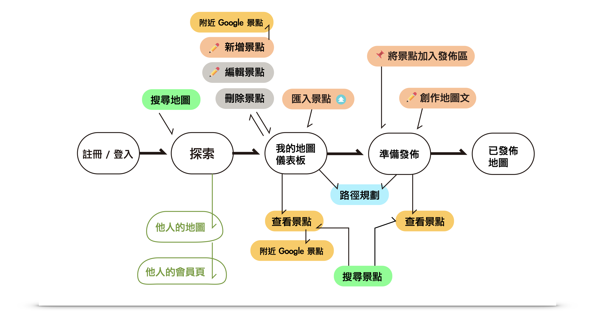
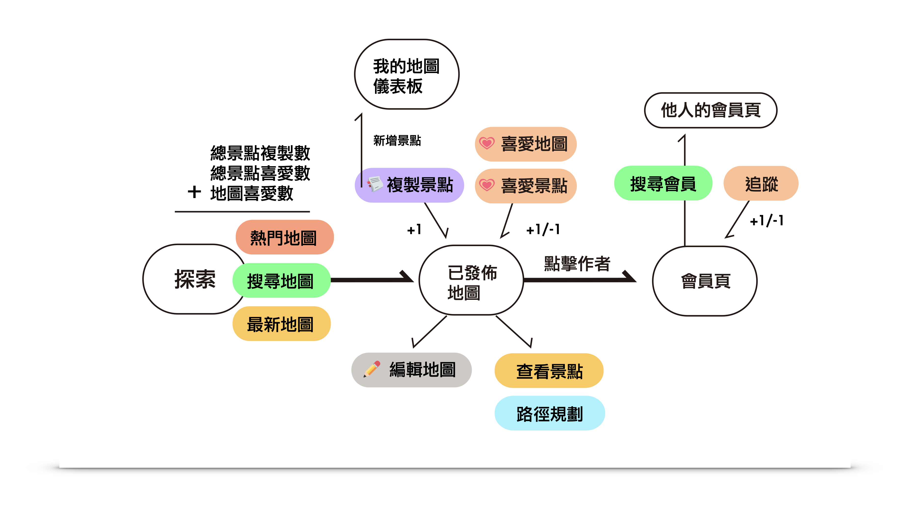

This is a [Next.js](https://nextjs.org/) project bootstrapped with [`create-next-app`](https://github.com/vercel/next.js/tree/canary/packages/create-next-app).

<iframe src="https://www.slideshare.net/slideshow/embed_code/key/E6YY8rWoZaJAnr?hostedIn=slideshare&page=upload" width="476" height="400" frameborder="0" marginwidth="0" marginheight="0" scrolling="no"></iframe>

# About Hidden Gem Spot

This is a Next.js Project using tailwind and Typescript aimed at providing people a platfrom to create contents for their attractions.
People can gather their private attractions and publish it to the public as a "Map post" with contents attached.
While others can like your map post, like your attractions with ❤️ and duplicate any attraction to their own private map.

Deployed with **Vercel** while using **CloudFlare** as DNS service at
[https://hidden-gem.xyz]()

**Database :** Using Firebase Firestore as NoSQL DB, Storage as Static DB
**Authentication:** Using Firebase Auth (Email, Google) and integrated with Clerk third-pary Auth (Web2 / Metamask)
Auth as

using Quill Markdown Editor and native Leaflet & OpenStreet Map as 3rd-party modules.
I also use several modules such as lazy loading, drap and drop (images) to improve the overall UX.
Also try some successful Jest tests.

What Else:

1. **Mini Game**
   Drap-n-drop module is used for drag attrations pins to the "bowl", which is the assigned drop-area to added them to the Map Post-to-be.
2. **NFT Minting**
   I used Web3.js and Clerk to allow users mint their NFTA simple HashLip NFT Contract was deployed using Remix, uploaded self-designed image (.png) to IPFS:// service, Pinata, to the Polygon Mainnet. Anyone with a Metamask Wallet can interact with the contact using either UI or polyscan to mint the NFT.
   [Hidden Gem Spot 旅圓 (hidden-gem.xyz)](https://hidden-gem.xyz/mintNFT)
3. Google API Integration
   By sending fetch request to the Google Places API, people can easily find any attractions around their selected spot.
4. KML & GeoJSON Upload
   people can upload their .KMZ/.KML file and GeoJSON, which made by Google Maps (one is from "My Map" at Google Maps, another is from Takeout function if you'd like to export your favorite (❤️) attractions and comments).
   We will convert them into attractions and saved them into database.


## Map

`/map component `provides you a leafet map allow you to create, edit, delete places related to the marker.
it also provides numberous plug-ins such as mini-map, search console and routing machine.
Routing machine allow you to create routes between markers (places, in this context).

## Dashboard

the dashboard along with the map allows people to create, edit contents for the attractions. You can add titles, contents, tags and choose categories and even upload images for any spot. You can also delete any spots.
**Search & Filter:** search any tag or keyword related to the spot, or filter what is your "likes ❤️".
**Show/Hide:** Any sub-function on the UI can be hidden, including uploading KMZ/KML/GeoJson, search & Filter,
and even the whole pupblic map post contents, so it won't cover the spot info you wanna take a look at.
**Switch Mode:** "Spot" mode and "Post" mode allow people to switch between browsing contents of a particular spot and write any serious post, so the dashboard won't be too crowded.

## Redux Toolkit / zustand

By using redux toolkit/zustand, I can easily manage the states of data.

**zustand:** simple, using for KMZ/KML and Geojson data to send directly to the map component.
**redux toolkit:** a bit complicated, using for the whole public map data to be saved, so if the author want to edit the whole map post, there's no need to visit

## useContext: Email, Google by Firebase Auth & Clerk

Since Clerk provide us with an intergration kit that saves any user data to the firebase firestore, there are muiltiple ways of logins and signups in my projects. Whether it's by Email or google provided by Firebase Auth, or it's clerk, useContext provides a solution to overall login states management.

## OnBoarding Process (Private Personal Map)



## Browsing Map Posts (Public)



### See the slides for a complete pitch here:

[https://www.slideshare.net/slideshows/hiddengem-attraction-recording-platform-slide/266594257]()

### Getting Started with Next

`npm install `  or use `yarn`  to install packages first.

Second, run the development server

```bash
npm run dev
# or
yarn dev
# or
pnpm dev
```

Open [http://localhost:3000](http://localhost:3000) with your browser to see the result.

You can start editing the pages by modifying everything under `src/pages `
 The page auto-updates as you edit the file since it's a Next App

# About Next.js

To learn more about Next.js, take a look at the following resources:

- [Next.js Documentation](https://nextjs.org/docs)  Next.js features and API.
- [Learn Next.js](https://nextjs.org/learn) Interactive Next.js tutorial.

Check out [the Next.js GitHub repository](https://github.com/vercel/next.js/) - your feedback and contributions are welcome!

## Deploy on Vercel

Using [Vercel Platform](https://vercel.com/new?utm_medium=default-template&filter=next.js&utm_source=create-next-app&utm_campaign=create-next-app-readme).

Reference:  [Next.js deployment documentation](https://nextjs.org/docs/deployment)
